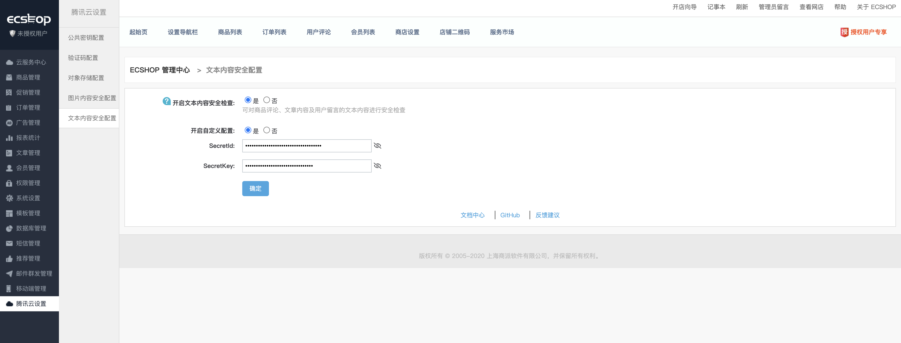
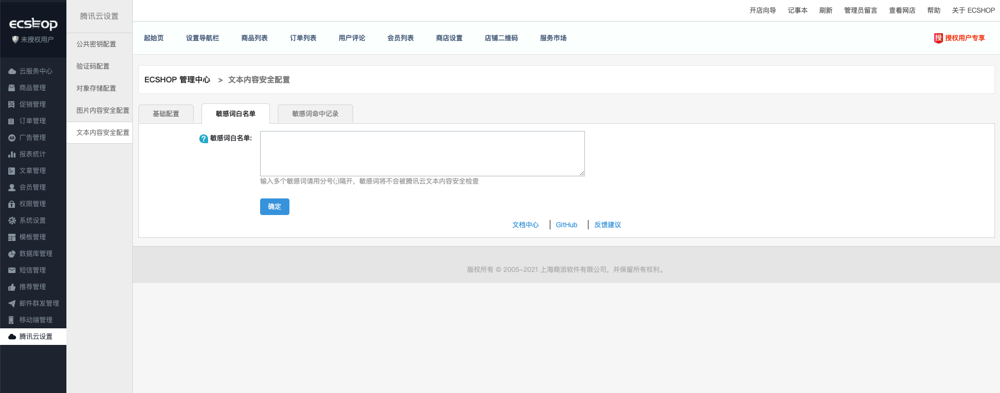
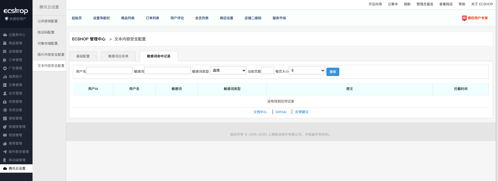
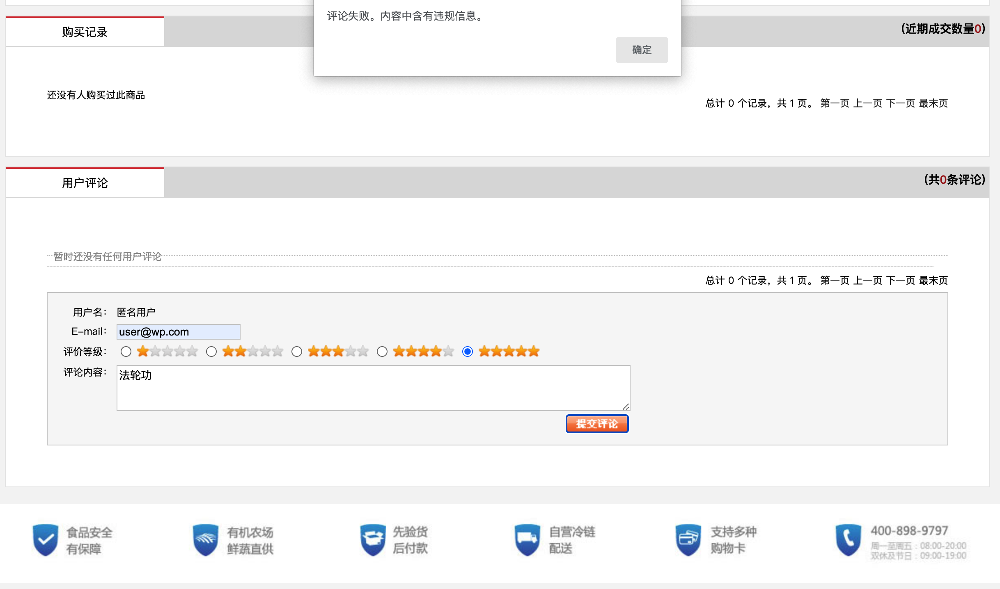
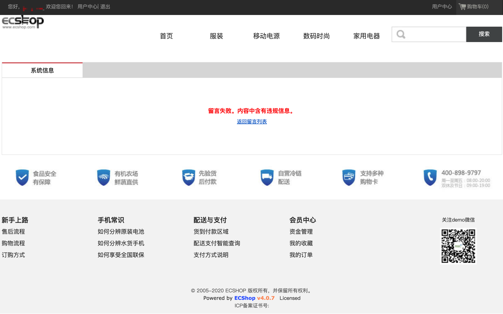
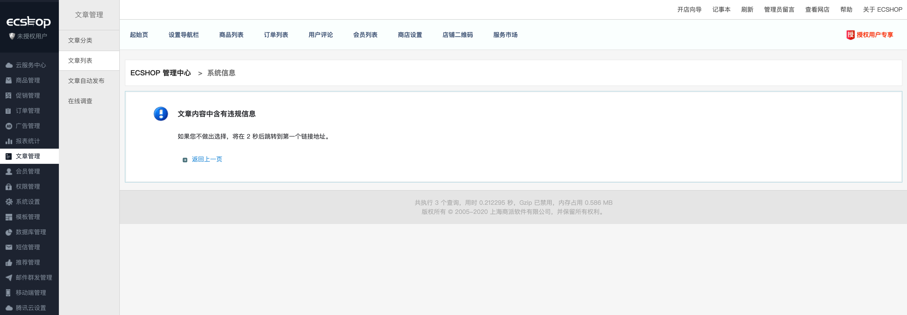
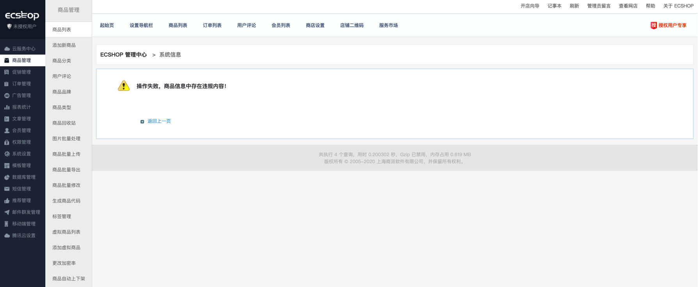

# 腾讯云文本内容安全

## 1.插件介绍

> 腾讯云文本内容安全插件可对商品评论、文章内容及用户留言的文本内容进行安全审核，识别过滤涉政、黄、爆、恐的信息。

| 标题       | 内容                                                         |
| ---------- | ------------------------------------------------------------ |
| 中文名称     | 腾讯云文本内容安全                                         |
| 最新版本   | v1.0.1 (2020.12.30)                                           |
| 适用平台   | [ECSHOP](https://www.ecshop.com/) 
| 适用产品   | [腾讯云文本内容安全（TMS）](https://cloud.tencent.com/product/tms)      |
| GitHub项目 | [腾讯云文本内容安全 ](https://github.com/Tencent-Cloud-Plugins/tencentcloud-ecshop-plugin-tms) |
| gitee项目 | [腾讯云文本内容安全 ](https://gitee.com/Tencent-Cloud-Plugins/tencentcloud-ecshop-plugin-tms) |
| 主创团队   | 腾讯云中小企业产品中心（SMB Product Center of Tencent Cloud）   

## 2.功能特性
- 支持对商品名称、商品描述、商品关键词以及商品评论内容进行文本安全检查，过滤涉及政、黄、爆、恐的信息
- 支持对用户中心->我的留言的主题和留言内容进行文本安全检查，过滤涉及政、黄、爆、恐的信息
- 支持对文章标题、文章作者、网页描述、文章内容进行文本安全检查，过滤涉及政、黄、爆、恐的信息
- 该插件还集成了ECShop腾讯云对象存储功能、腾讯云验证码功能、腾讯云图片安全功能

## 3.安装指引

### 3.1.部署方式一：通过GitHub部署安装
腾讯云对象存储功能兼容的ECShop版本：v4.0.7 RELEASE 20200102
> 1. git clone https://github.com/Tencent-Cloud-Plugins/tencentcloud-ecshop-plugin-tms.git，仓库中的代码包含腾讯验证码功能和对象存储功能，安装后可选中是否开启。
> 2. 将tencentcloud-captcha/ecshop文件夹中相关文件的代码合并到源码中对应文件中，推荐使用代码比较工具（Beyoned Compare）进行代码合并
- **修改说明1**：ecshop/js/目录中加入腾讯云验证码依赖的TCaptcha.js文件
> 1. /ecshop/tencentcloud_captcha/ecshop/js/TCaptcha.js
- **修改说明2**：加入腾讯云对象存储、验证码、图片内容安全、文本内容安全接口的依赖库
> 1. /ecshop/includes/cls_tencentcloud_captcha.php
> 2. /ecshop/includes/cls_tencentcloud_center.php
> 3. /ecshop/includes/cls_tencentcloud_cos.php
> 3. /ecshop/includes/cls_tencentcloud_ims.php
> 3. /ecshop/includes/cls_tencentcloud_tms.php
> 4. /ecshop/includes/tencent_cloud整个目录
- **修改说明3**：修改验证码管理页面相关文件
> 1. /ecshop/admin/templates/captcha_manage.htm
> 2. /ecshop/admin/captcha_manage.php
- **修改说明4**：添加腾讯云插件管理菜单及对象存储、验证吗、图片内容安全、文本内容安全的配置页面
> 1. /ecshop/admin/includes/inc_icon.php
> 2. /ecshop/admin/includes/inc_menu.php
> 3. /ecshop/admin/includes/inc_priv.php
> 4. /ecshop/admin/templates/tencent_captcha.htm
> 5. /ecshop/admin/templates/tencent_center.htm
> 5. /ecshop/admin/templates/tencent_cos.htm
> 5. /ecshop/admin/templates/tencent_ims.htm
> 5. /ecshop/admin/templates/tencent_tms.htm
> 5. /ecshop/admin/templates/goods_info.htm
> 6. /ecshop/admin/tencent_captcha.php
> 7. /ecshop/admin/tencent_center.php
> 7. /ecshop/admin/tencent_cos.php
> 7. /ecshop/admin/tencent_ims.php
> 7. /ecshop/admin/tencent_tms.php
- **修改说明5**：后台登录页面腾讯云验证码功能代码修改
> 1. /ecshop/admin/templates/login.htm
> 2. /ecshop/admin/privilege.php
- **修改说明6**：登录、注册、商品评价、留言时验证码及文本内容安全相关代码修改
> 1. /ecshop/user.php
> 2. /ecshop/comment.php
> 3. /ecshop/themes/default/user_clips.dwt
> 4. /ecshop/themes/default/user_passport.dwt
> 5. /ecshop/themes/default/library/comments_list.lbi
> 6. /ecshop/includes/lib_insert.php
> 7. /ecshop/includes/lib_main.php
- **修改说明7**：商品新增修改上传时对图片的远程存储操作
> 1. /ecshop/goods.php
> 2. /ecshop/admin/goods.php
> 3. /ecshop/admin/includes/lib_goods.php
> 4. /ecshop/includes/lib_goods.php
> 5. /ecshop/includes/fckeditor/editor/filemanager/connectors/php/commands.php
- **修改说明8**：商品展示模板
> 1. /ecshop/admin/templates/goods_info.htm
- **修改说明9**：语言文件修改(简体中文、繁体中文、英文)
> 1. /ecshop/languages/zh_cu/admin/captcha_manage.php
> 2. /ecshop/languages/zh_cu/admin/common.php
> 3. /ecshop/languages/zh_cu/admin/tencent_captcha.php
> 4. /ecshop/languages/zh_cu/admin/tencent_center.php
> 5. /ecshop/languages/zh_cu/admin/tencent_ims.php
> 6. /ecshop/languages/zh_cu/admin/tencent_tms.php
> 7. /ecshop/languages/zh_cu/admin/users.php
> 8. /ecshop/languages/zh_cu/user.php
> 9. /ecshop/languages/zh_cu/admin/tencent_cos.php
> 10. /ecshop/languages/zh_cu/common.php
> 11. /ecshop/languages/zh_cu/admin/article.php
## 4.使用指引

### 4.1. 页面功能介绍

> 腾讯云文本内容安全配置页面。

> 腾讯云文本内容安全敏感词白名单配置页面，白名单中的关键词不做文本安全检查。

> 腾讯云文本内容安全敏感词命中记录查询页面，可查询敏感词命中历史记录。

> 对商品评论进行文本安全检查。

> 对留言内容进行文本安全检查。

> 对文章内容进行文本安全检查。

> 对商品信息进行文本安全检查。

### 4.2. 名词解释
- **自定义密钥**：插件提供统一密钥管理，既可在多个腾讯云插件之间共享SecretId和SecretKey，也可为插件配置单独定义的腾讯云密钥。
- **SecretId**：在腾讯云云平台API密钥上申请的标识身份的 SecretId。详情参考[腾讯云文档](https://cloud.tencent.com/document/product)
- **SecretKey**：在腾讯云云平台API密钥上申请的标识身份的SecretId对应的SecretKey。详情参考[腾讯云文档](https://cloud.tencent.com/document/product)
## 5.获取入口

| 插件入口 | 链接                                                         |
| -------- | ------------------------------------------------------------ |
| GitHub   | [link](https://github.com/Tencent-Cloud-Plugins/tencentcloud-ecshop-plugin-tms) |
| gitee    | [link](https://gitee.com/Tencent-Cloud-Plugins/tencentcloud-ecshop-plugin-tms) |

## 6.FAQ
> 暂无
## 7.GitHub版本迭代记录
## 7.GitHub版本迭代记录
### 2020-12-30 tencentcloud-ecshop-plugin-tms v1.0.1
- 支持配置敏感词白名单，白名单中的关键词不会做文本安全检查。
- 支持敏感词命中记录查询
### 2020-12-03 tencentcloud-ecshop-plugin-tms v1.0.0
- 支持对商品评论内容进行文本安全检查，过滤涉及政、黄、爆、恐的信息
- 支持对用户中心->我的留言的主题和留言内容进行文本安全检查，过滤涉及政、黄、爆、恐的信息
- 支持对文章标题、文章作者、网页描述、文章内容进行文本安全检查，过滤涉及政、黄、爆、恐的信息
- 该插件还集成了ECShop腾讯云对象存储功能、腾讯云验证码功能、腾讯云图片安全功能

---

本项目由腾讯云中小企业产品中心建设和维护，了解与该插件使用相关的更多信息，请访问[春雨文档中心](https://openapp.qq.com/docs/Ecshop/tms.html) 

请通过[咨询建议](https://da.do/y0rp) 向我们提交宝贵意见。